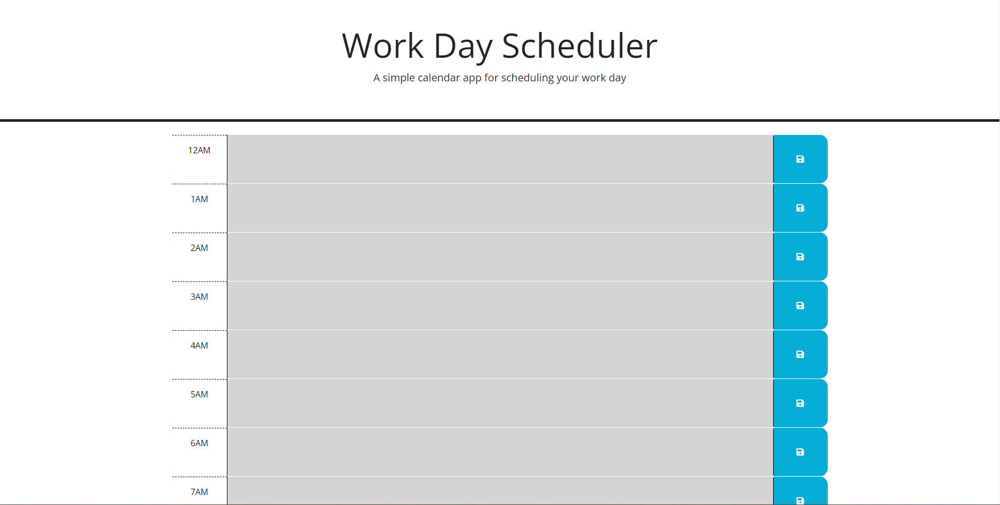

# 05_Scheduler

## Description

This challenge was to make a responsive work schedule using HTML, CSS, and JavaScript. We were given initial HTML and CSS code but had a TODO List for our JS. 

## Usage

To use this, go to https://joshhill1.github.io/05_Scheduler/
and you should be able to see something like this:

